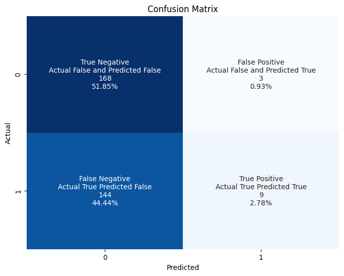
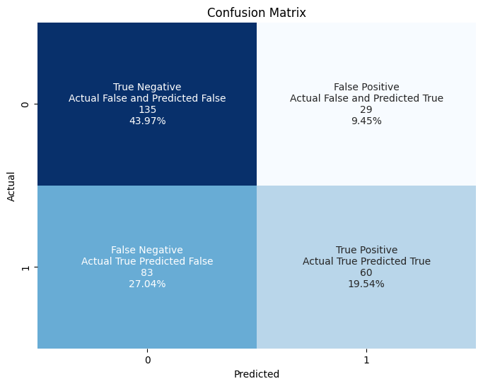

# Translation Filter LLM Evaluation

Dataset : [satpalsr/chatml-translation-filter](https://huggingface.co/datasets/satpalsr/chatml-translation-filter)

Fine Tuned Model : [satpalsr/llama2-translation-filter-full](https://huggingface.co/satpalsr/llama2-translation-filter-full)


## Initial Exploration

- The model was Fine Tuned on Llama2.
    - Possible Prompt Template : 
    ```python
    <s>[INST] <<SYS>>
    {{ system_prompt }}
    <</SYS>> {{ user_message }} [/INST]
    ```
- Dataset  `satpalsr/chatml-translation-filter`
    - e.g. : 
    ```json
    [ { "from": "system", "value": "For a given question assess whether translating the potential answer to another language might yield an inaccurate response. Avoid translation in tasks related to coding problems, alliteration, idioms, paraphrasing text, word count, spelling correction, and other linguistic constructs or contextual nuances that may affect the accuracy of the answer. When translation is deemed unsuitable, output {\"translate\": False}. Otherwise, output {\"translate\": True}." }, { "from": "human", "value": "Suggest a new design for the following website. Website: http://www.example.com" }, { "from": "gpt", "value": "{\"translate\": False}" } ]
    ```

    - Okay so Value in `gpt` response `value` has "{\"translate\": True}". On first look it seems it's json So we could simply use json loads but on careful inspection `True` or `False` are onot valid json types. This is plain python dict.
    - Would be better if one had trained it on json. A more efficient and better option.
    - We can use python's eval built-in function or ast library to parse
    - train data : 1.88k rows
        - Translate True rows = 829
        - Translate False = 1049
        - True False Ratio is 4:5
        - A little biased on False side but that's fine.
    - validation data : 324 rows

- Modal (https://modal.com)
    - Super Cool tool. Run Something remotely and something on local device. Moreover they give $30 by which we can use a100 nvidia gpu.

## Chain Of Action

- To explore the model's output and trying model to see how it outputs on various templates. I pulled the model to from hf, qunatized to 4 bit using `bitsandbytes`, load the model with `transformers` and tried first initial prompt_template i.e 
    ```python
    <s>[INST] <<SYS>>
    {{ system_prompt }}
    <</SYS>> {{ user_message }} [/INST]
    ```
    Output was some other kind of extended text.
Conclusion : model wasn't finetuned with this prompt template.

- Instead of Applying various prompt template out of the blue. I researched model configs in [satpalsr/llama2-translation-filter-full](https://huggingface.co/satpalsr/llama2-translation-filter-full)
    - Found file `added_tokens.json`
    which had following data
    ```json
    {
        "<|im_end|>": 32001,
        "<|im_start|>": 32000
    }
    ```

    - First thought from this was that the since added new tokens in the tokenizer and model, prompt template would be

    ```python
    python.template = """<|im_start|>system
    {system}<|im_end|>
    <|im_start|>human
    {user}<|im_end|>
    <|im_start|>gpt
    """
    ```
    Choosing (system, human, gpt) was deduced from the dataset

    Fine-tuned Model started to give output in the given output format.

    but mostly would return nothing.

    On further googling I found another template
    ```python
    python.template = """<|im_start|>system
    {system}<|im_end|>
    <|im_start|>user
    {user}<|im_end|>
    <|im_start|>assistant
    """
    ```

    Run the following command to try it yourself :
    ```bash
    modal run evaluate
    ```
    Note: Remeber to install requirements
    And now output was generated in consistent format every time

- Running the model on Modal
    - Based on the following article https://modal.com/docs/examples/vllm_inference learnt
    - For the deterministic kind of task we should use 0% temperature in Sampling Arguments for prediction. But the outputs returned mostly false. Which is absurd. 
    - Model is not trained correctly. 
    - To check it on another temperature I used variety of Temperature and achieved this :


    | Temperature   | Total | Total Predicted Translate | Total Predicted Don't Translate | Total Actual Translate | Total Actual Don't Translate | Correct Translate | Incorrect Translate | Correct Don't Translate | Incorrect Don't Translate | Total Correct | Total Incorrect | No Output | Achieved Accuracy | Achieved Sensitivity | Achieved Specificity |
    |----|-------|----------------------------|---------------------------------|------------------------|-----------------------------|-------------------|---------------------|-------------------------|---------------------------|---------------|----------------|-----------|-------------------|----------------------|----------------------|
    | 0%  | 324   | 12                         | 312                             | 153                    | 171                         | 9                 | 3                   | 168                     | 144                       | 177           | 147            | 0         | 0.546296          | 0.058824             | 0.979592             |
    | 10%  | 324   | 10                         | 314                             | 153                    | 171                         | 8                 | 2                   | 169                     | 145                       | 177           | 147            | 0         | 0.546296          | 0.052288             | 0.986395             |
    | 20%  | 324   | 26                         | 298                             | 153                    | 171                         | 21                | 5                   | 166                     | 132                       | 187           | 137            | 0         | 0.577160          | 0.137255             | 0.963504             |
    | 30%  | 324   | 36                         | 288                             | 153                    | 171                         | 28                | 8                   | 163                     | 125                       | 191           | 133            | 0         | 0.589506          | 0.183007             | 0.939850             |
    | 40%  | 324   | 41                         | 283                             | 153                    | 171                         | 31                | 10                  | 161                     | 122                       | 192           | 132            | 0         | 0.592593          | 0.202614             | 0.924242             |
    | 50%  | 324   | 58                         | 265                             | 153                    | 171                         | 43                | 15                  | 155                     | 110                       | 198           | 125            | 1         | 0.613003          | 0.281046             | 0.880000             |
    | 60%  | 324   | 76                         | 247                             | 153                    | 171                         | 54                | 22                  | 148                     | 99                        | 202           | 121            | 1         | 0.625387          | 0.352941             | 0.818182             |
    | 70%  | 324   | 76                         | 248                             | 153                    | 171                         | 53                | 23                  | 148                     | 100                       | 201           | 123            | 0         | 0.620370          | 0.346405             | 0.813008             |
    | 80%  | 324   | 83                         | 238                             | 153                    | 171                         | 52                | 31                  | 137                     | 101                       | 189           | 132            | 3         | 0.588785          | 0.339869             | 0.765152             |
    | 90%  | 324   | 78                         | 239                             | 153                    | 171                         | 46                | 32                  | 134                     | 105                       | 180           | 137            | 7         | 0.567823          | 0.304636             | 0.766423             |
    | 100% | 324   | 89                         | 218                             | 153                    | 171                         | 60                | 29                  | 135                     | 83                        | 195           | 112            | 17        | 0.635179          | 0.419580             | 0.741071             |

    I could have tweaked top_p or top_k and other args. But since output is suppesed to of only {"translate": True} or {"translate": False}, changing top_p and top_k wuldn't be significant.


    Confusion Matrix at Temperature 0% 

    

    Confusion Matrix at Temperature 100% 
    
    

    Max accuracy achieved is 63%(at 1 temperature) which is quite decent improvement over random 50%.


## Suggestion

- A high Prediction of False in Translation proves that model is biased towards predicting false.
- Quality of Training Data should be checked and verified. Most accuracy depends on it.
- One can include categories in output of assistant in training data for why the model generated output false, categories may include as defined in system prompt
    - coding problems
    - alliteration
    - idioms
    - paraphrasing text
    - word count
    - spelling correction
    - other linguistic constructs
    - contextual nuances
    - other
- I believe having category in the output will help the model learn from context of reason of getting 
